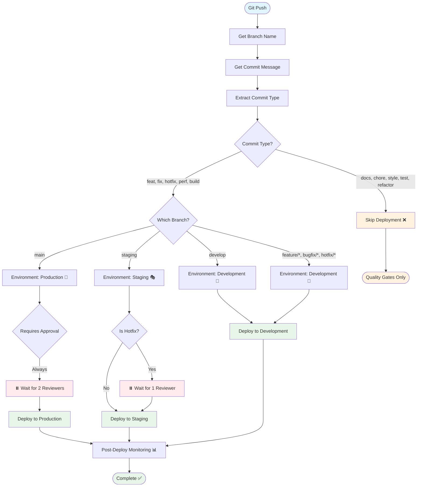

# CI/CD Pipeline Flow

## Decision Flow Diagram

The above Mermaid diagram shows the complete decision flow from git push to deployment.

## Key Decision Points

### 1️⃣ Commit Type Check
First decision: Is this a deployable commit?
- **Deployable**: `feat`, `fix`, `hotfix`, `perf`, `build`
- **Skip**: `docs`, `chore`, `style`, `test`, `refactor`, `ci`

### 2️⃣ Branch Routing
If deployable, determine target environment:
- `main` → Production (requires approval)
- `staging` → Staging
- `develop` → Development
- `feature/*`, `bugfix/*`, `hotfix/*` → Development

### 3️⃣ Approval Gates
Check if manual approval is required:
- Production deployments: **Always** require 2 reviewers
- Staging hotfixes: Require 1 reviewer
- All other deployments: Auto-deploy

### 4️⃣ Post-Deployment
After successful deployment:
- Health checks
- Smoke tests
- Monitoring
- Alerting

## Example Flows

### Flow A: Feature to Production
```
Developer Push (feat:) 
  → feature/CR-123 
  → Deploy to DEV ✅ 
  → PR to staging 
  → Deploy to STAGING ✅ 
  → PR to main 
  → Wait for Approval ⏸️ 
  → Deploy to PRODUCTION 🚀
```

### Flow B: Documentation Update
```
Developer Push (docs:) 
  → feature/CR-456 
  → Run Quality Gates 
  → Skip Deployment ❌ 
  → Complete
```

### Flow C: Emergency Hotfix
```
Critical Issue Found 
  → Create hotfix/BF-789 
  → Commit (hotfix:) 
  → Fast-track to main 
  → Expedited Approval ⚡ 
  → Deploy to PRODUCTION 🚀 
  → Monitor Closely 📊
```

## Environment States

```
┌─────────────────────────────────────────────────────────┐
│                   Production (main)                      │
│  - Manual approval required (2 reviewers)                │
│  - 10 minute wait timer                                  │
│  - Full smoke tests                                      │
│  - Enhanced monitoring                                   │
│  - Rollback capability                                   │
│  URL: https://insighthub.example.com                     │
└─────────────────────────────────────────────────────────┘
                            ▲
                            │ PR + Approval
                            │
┌─────────────────────────────────────────────────────────┐
│                   Staging (staging)                      │
│  - Auto-deploy (except hotfixes)                         │
│  - Optional 5 minute wait                                │
│  - Smoke tests                                           │
│  - Standard monitoring                                   │
│  URL: https://staging.insighthub.example.com             │
└─────────────────────────────────────────────────────────┘
                            ▲
                            │ PR
                            │
┌─────────────────────────────────────────────────────────┐
│              Development (develop)                       │
│  - Auto-deploy always                                    │
│  - Basic tests                                           │
│  - Development monitoring                                │
│  URL: https://dev.insighthub.example.com                 │
└─────────────────────────────────────────────────────────┘
                            ▲
                            │ PR
                            │
┌─────────────────────────────────────────────────────────┐
│        Feature Branches (feature/*, bugfix/*)            │
│  - Auto-deploy to dev                                    │
│  - Unit tests only                                       │
│  - No production risk                                    │
└─────────────────────────────────────────────────────────┘
```

## Pipeline Jobs

```
┌──────────────┐
│  Decision    │  Determine env, check commit type, set approval flag
└──────┬───────┘
       │
       ▼
┌──────────────┐
│   Quality    │  Lint, test, security audit, coverage
└──────┬───────┘
       │
       ▼
┌──────────────┐
│    Build     │  Build client + server artifacts
└──────┬───────┘
       │
       ▼
┌──────────────────────────────────────────────┐
│         Environment-Specific Deploy          │
│  ┌──────────┐  ┌──────────┐  ┌──────────┐  │
│  │   Dev    │  │  Staging │  │   Prod   │  │
│  │  Auto    │  │  Auto*   │  │ Approval │  │
│  └──────────┘  └──────────┘  └──────────┘  │
└──────────────────────┬───────────────────────┘
                       │
                       ▼
                ┌──────────────┐
                │   Monitor    │  Health checks, alerts, reports
                └──────────────┘
```

## Approval Process

### Production Deployment Approval

```
1. Pipeline reaches production deploy job
2. GitHub pauses and requests approval
3. Notification sent to approval team
4. Required: 2 approvals from designated reviewers
5. Wait timer: 10 minutes minimum
6. Upon approval: Deployment proceeds
7. Upon rejection: Deployment cancelled
```

### Approval Team Configuration

```yaml
# .github/CODEOWNERS
* @devops-team @tech-leads

# Required in GitHub Environment Settings
Environment: production
Required reviewers: 
  - @senior-devops-engineer
  - @tech-lead
  - @cto
Protection rules:
  - Minimum 2 approvals required
  - Wait timer: 10 minutes
  - Deployment branches: main only
```

## Monitoring Dashboard

After deployment, monitor these metrics:

| Metric | Target | Alert Threshold |
|--------|--------|-----------------|
| Response Time | < 500ms | > 1000ms |
| Error Rate | < 1% | > 5% |
| CPU Usage | < 70% | > 85% |
| Memory Usage | < 80% | > 90% |
| Request Rate | Baseline +/- 20% | +/- 50% |
| Database Connections | < 80% pool | > 95% pool |

---

**View this file with a Mermaid-compatible viewer:**
- GitHub (renders automatically)
- VS Code (with Mermaid extension)
- Mermaid Live Editor: https://mermaid.live/
