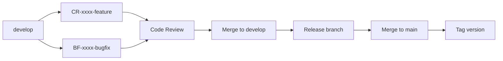

# Git Branch Naming Standards

This document defines the branch naming conventions for the InsightHub project.

## Branch Naming Convention

All feature branches must start with one of these prefixes:

### CR - Change Request (Features/Enhancements)
Use `CR` prefix for new features, enhancements, or change requests.

**Format**: `CR-<ticket-number>-<short-description>`

**Examples**:
```bash
CR-1234-powerbi-integration
CR-5678-user-dashboard
CR-9012-export-reports
CR-3456-add-authentication
```

### BF - Bug Fix
Use `BF` prefix for bug fixes.

**Format**: `BF-<ticket-number>-<short-description>`

**Examples**:
```bash
BF-2345-fix-login-error
BF-6789-resolve-memory-leak
BF-1111-patch-security-issue
BF-4567-correct-date-format
```

## Additional Branch Types (Optional)

For internal workflows, you may also use:

### hotfix - Production Hotfixes
**Format**: `hotfix/<version>-<description>`
```bash
hotfix/1.2.1-critical-security-patch
```

### release - Release Preparation
**Format**: `release/<version>`
```bash
release/1.3.0
```

## Creating a New Branch

### For Change Requests (Features)

```bash
# Create and switch to new CR branch
git checkout -b CR-1234-feature-name

# Example: PowerBI integration
git checkout -b CR-5001-powerbi-integration
```

### For Bug Fixes

```bash
# Create and switch to new BF branch
git checkout -b BF-1234-bug-description

# Example: Fix auth timeout
git checkout -b BF-3002-fix-auth-timeout
```

## Commit Message Standards

Follow [Conventional Commits](https://www.conventionalcommits.org/) specification:

### Format
```
<type>(<scope>): <subject>

<body>

<footer>
```

### Types

- **feat**: New feature (CR branches)
- **fix**: Bug fix (BF branches)
- **docs**: Documentation changes
- **style**: Code style changes (formatting, etc.)
- **refactor**: Code refactoring
- **perf**: Performance improvements
- **test**: Adding or updating tests
- **chore**: Maintenance tasks
- **build**: Build system changes
- **ci**: CI/CD changes

### Examples

**For CR (Change Request) branches:**
```bash
git commit -m "feat(powerbi): add embedded report viewer

- Implement PowerBI SDK integration
- Add authentication service
- Create report component

CR-5001"
```

**For BF (Bug Fix) branches:**
```bash
git commit -m "fix(auth): resolve token expiration issue

- Extend token refresh logic
- Add retry mechanism
- Improve error handling

BF-3002"
```

**Documentation updates:**
```bash
git commit -m "docs: update API documentation

- Add PowerBI endpoints
- Update authentication flow
- Add examples"
```

**Chore tasks:**
```bash
git commit -m "chore: bump version to 1.2.0

- Update all package.json files
- Update CHANGELOG.md"
```

## Complete Workflow Example

### Creating a Change Request Branch

```bash
# 1. Start from main/develop
git checkout develop
git pull origin develop

# 2. Create CR branch
git checkout -b CR-5001-powerbi-integration

# 3. Make changes
# ... edit files ...

# 4. Commit with conventional format
git add .
git commit -m "feat(powerbi): implement embedded reporting

- Add PowerBI SDK integration
- Create report viewer component
- Add authentication service

CR-5001"

# 5. Push to remote
git push origin CR-5001-powerbi-integration

# 6. Create Pull Request on GitHub
# Title: [CR-5001] PowerBI Integration
# Description: Implements embedded PowerBI reporting
```

### Creating a Bug Fix Branch

```bash
# 1. Start from main/develop
git checkout develop
git pull origin develop

# 2. Create BF branch
git checkout -b BF-3002-fix-auth-timeout

# 3. Make changes
# ... fix bug ...

# 4. Commit with fix type
git add .
git commit -m "fix(auth): resolve token timeout issue

- Increase token refresh interval
- Add retry logic for failed requests
- Improve error messages

BF-3002"

# 5. Push to remote
git push origin BF-3002-fix-auth-timeout

# 6. Create Pull Request
# Title: [BF-3002] Fix Authentication Timeout
# Description: Resolves token timeout issues
```

## Branch Naming Rules

✅ **DO:**
- Use CR prefix for features/enhancements
- Use BF prefix for bug fixes
- Use lowercase with hyphens
- Keep descriptions short and clear
- Include ticket/issue number
- Use descriptive names

❌ **DON'T:**
- Use spaces in branch names
- Use special characters (except hyphens)
- Create overly long names
- Use vague descriptions
- Forget the prefix

## Pull Request Title Format

Match the branch prefix in PR titles:

**For CR branches:**
```
[CR-5001] Implement PowerBI Integration
```

**For BF branches:**
```
[BF-3002] Fix Authentication Timeout Issue
```

## Automated Branch Naming Helper

Create a script to help with branch naming:

```bash
#!/bin/bash
# scripts/create-branch.sh

TYPE=$1
TICKET=$2
DESCRIPTION=$3

if [ -z "$TYPE" ] || [ -z "$TICKET" ] || [ -z "$DESCRIPTION" ]; then
  echo "Usage: ./scripts/create-branch.sh <CR|BF> <ticket-number> <description>"
  echo ""
  echo "Examples:"
  echo "  ./scripts/create-branch.sh CR 5001 powerbi-integration"
  echo "  ./scripts/create-branch.sh BF 3002 fix-auth-timeout"
  exit 1
fi

# Validate type
if [[ ! "$TYPE" =~ ^(CR|BF)$ ]]; then
  echo "❌ Error: Type must be CR or BF"
  exit 1
fi

# Create branch name
BRANCH_NAME="${TYPE}-${TICKET}-${DESCRIPTION}"

# Create and checkout branch
echo "🌿 Creating branch: $BRANCH_NAME"
git checkout -b "$BRANCH_NAME"

echo "✅ Branch created and checked out"
echo ""
echo "Next steps:"
echo "1. Make your changes"
echo "2. Commit with: git commit -m \"<type>: <message>\""
echo "3. Push with: git push origin $BRANCH_NAME"
```

Usage:
```bash
chmod +x scripts/create-branch.sh

# Create CR branch
./scripts/create-branch.sh CR 5001 powerbi-integration

# Create BF branch
./scripts/create-branch.sh BF 3002 fix-auth-timeout
```

## Branch Lifecycle



## Git Hooks for Validation

Create a pre-push hook to validate branch names:

```bash
#!/bin/bash
# .git/hooks/pre-push

current_branch=$(git symbolic-ref --short HEAD)

# Check if branch follows naming convention
if [[ ! $current_branch =~ ^(CR|BF|hotfix|release|main|develop) ]]; then
  echo "❌ Invalid branch name: $current_branch"
  echo ""
  echo "Branch names must start with:"
  echo "  - CR-xxxx-description (Change Request)"
  echo "  - BF-xxxx-description (Bug Fix)"
  echo ""
  echo "Example: CR-5001-powerbi-integration"
  exit 1
fi

echo "✅ Branch name valid: $current_branch"
```

## Summary

| Prefix | Purpose | Format | Example |
|--------|---------|--------|---------|
| **CR** | Change Request/Feature | `CR-<ticket>-<description>` | `CR-5001-powerbi-integration` |
| **BF** | Bug Fix | `BF-<ticket>-<description>` | `BF-3002-fix-auth-timeout` |
| hotfix | Production Hotfix | `hotfix/<version>-<description>` | `hotfix/1.2.1-security-patch` |
| release | Release Preparation | `release/<version>` | `release/1.3.0` |

---

**Last Updated**: December 28, 2025  
**Applies to**: All InsightHub development
