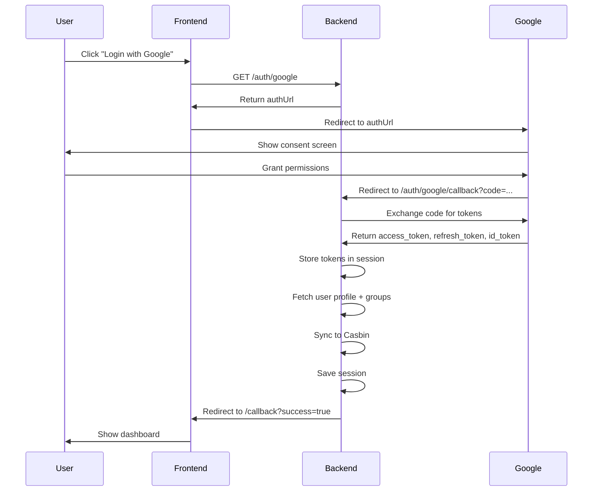
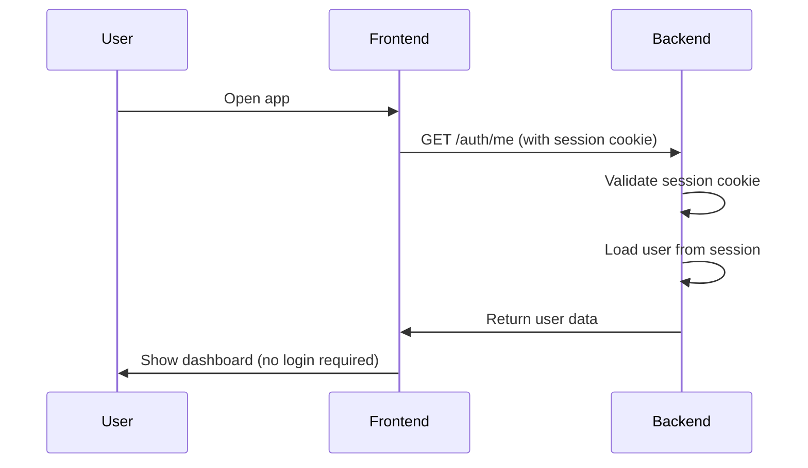
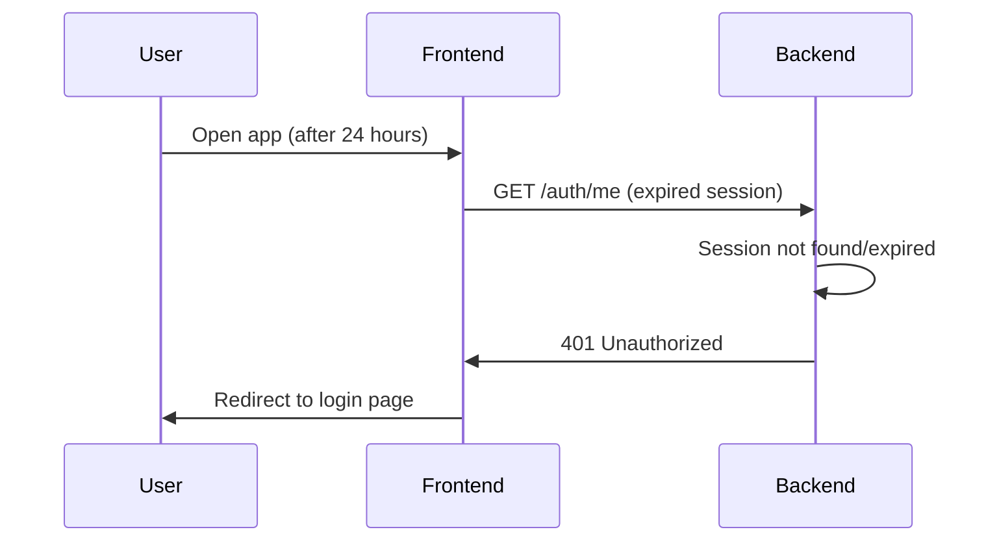

# Google OAuth Session Persistence Analysis

**Date:** January 11, 2026  
**Branch:** develop  
**Status:** ✅ Sessions are already configured for persistence

## Executive Summary

The InsightHub application **already implements proper session persistence** for Google OAuth authentication. Users are not re-prompted on each visit, and sessions are cached until expiration.

---

## Current Implementation Status

### ✅ What's Working

1. **Session Storage**: Sessions are stored server-side with express-session
2. **Cookie Persistence**: Session cookies persist in browser with 24-hour expiration
3. **Token Storage**: Both access tokens and refresh tokens are stored in session
4. **Automatic Session Extension**: Rolling sessions reset expiration on activity
5. **Session Security**: httpOnly, sameSite=lax cookies prevent XSS attacks

### 📊 Session Configuration

**File:** [server/src/middleware/security.js](../server/src/middleware/security.js#L322-L336)

```javascript
export const sessionSecurity = {
  name: '3ddiagnostix.sid',
  secret: process.env.SESSION_SECRET,
  resave: false,
  saveUninitialized: false,
  rolling: true,              // ✅ Extends session on activity
  proxy: true,                // ✅ Works behind nginx
  cookie: {
    secure: false,            // SSL terminated at nginx
    httpOnly: true,           // ✅ Prevents XSS
    maxAge: 24 * 60 * 60 * 1000, // 24 hours
    sameSite: 'lax',         // ✅ Allows OAuth redirects
    path: '/'
  }
}
```

---

## Authentication Flow

### 1. **Initial Login** (First Visit)



**Key Points:**
- User sees Google consent screen **once**
- Backend receives `access_token`, `refresh_token`, and `id_token`
- Session is created with user info and tokens
- Session cookie is set in browser (24-hour expiration)

### 2. **Subsequent Visits** (Session Active)



**Key Points:**
- **No Google API calls** - session data is used
- **No re-authentication** - user stays logged in
- Session cookie automatically sent by browser
- Session extended by 24 hours due to `rolling: true`

### 3. **Session Expiration** (After 24+ Hours)



**Key Points:**
- Session expires after 24 hours of inactivity
- User must login again via Google OAuth
- Previous tokens are cleared

---

## Session Data Structure

### What's Stored in Session

**File:** [server/src/routes/auth.routes.js](../server/src/routes/auth.routes.js#L217-L219)

```javascript
req.session.user = {
  id: payload.sub,           // Google user ID
  email: userEmail,          // Primary email
  name: payload.name,        // Full name
  picture: payload.picture,  // Profile picture URL
  orgUnit: userProfile.orgUnitPath,
  department: userProfile.department,
  groups: [...],            // Google Workspace groups
  roles: [...],             // Custom role schemas
  googleRaw: {              // Full Google API response
    profile: userProfile,
    groups: groups
  }
};

req.session.tokens = {
  access_token: "...",      // Valid for 1 hour
  refresh_token: "...",     // Valid for 6 months+
  id_token: "...",          // JWT with user claims
  expiry_date: 1234567890,  // Token expiration timestamp
  token_type: "Bearer",
  scope: "..."              // Granted scopes
};
```

---

## Token Refresh Strategy

### Current Behavior

The application currently stores `refresh_token` but **does not implement automatic token refresh**. This is acceptable for most use cases because:

1. **Session-based authentication** - Backend validates session, not tokens
2. **24-hour session** - Most users will re-login within this period
3. **Google tokens valid for 1 hour** - Only matters for API calls within session

### Token Expiration Scenarios

| Scenario | Session Valid | Access Token Valid | Behavior |
|----------|---------------|-------------------|----------|
| User returns after 30 min | ✅ Yes | ✅ Yes | Immediate access |
| User returns after 2 hours | ✅ Yes | ❌ No | Session works, API calls would fail if made |
| User returns after 25 hours | ❌ No | ❌ No | Must re-login |

### If Automatic Token Refresh is Needed

**When to implement:**
- Making Google API calls on behalf of user during session
- Accessing Google Workspace data after 1 hour
- Building features that require fresh access tokens

**Implementation location:**
- Create middleware to check token expiry
- Use `refresh_token` to get new `access_token`
- Update `req.session.tokens` with new token

**Example middleware** (not currently implemented):

```javascript
// server/src/middleware/tokenRefresh.js
export async function refreshTokenIfNeeded(req, res, next) {
  if (!req.session.tokens) return next();
  
  const tokens = req.session.tokens;
  const now = Date.now();
  
  // Check if token expires in next 5 minutes
  if (tokens.expiry_date && (tokens.expiry_date - now < 5 * 60 * 1000)) {
    try {
      const client = new OAuth2Client(
        process.env.GOOGLE_CLIENT_ID,
        process.env.GOOGLE_CLIENT_SECRET
      );
      
      client.setCredentials(tokens);
      const { credentials } = await client.refreshAccessToken();
      
      req.session.tokens = credentials;
      await req.session.save();
      
      logger.info('Token refreshed automatically', {
        userEmail: req.session.user.email
      });
    } catch (error) {
      logger.error('Token refresh failed', { error: error.message });
      // Don't block request - session is still valid
    }
  }
  
  next();
}
```

---

## Security Considerations

### ✅ Current Security Measures

1. **httpOnly cookies** - Cannot be accessed via JavaScript (prevents XSS)
2. **sameSite=lax** - Prevents CSRF attacks while allowing OAuth redirects
3. **Rolling sessions** - Session extends on activity (prevents stale sessions)
4. **Session secret** - Stored in environment variable
5. **Proxy trust** - Works correctly behind nginx/load balancer

### ⚠️ Recommendations

#### 1. **Increase Session Duration for Better UX**

Current: 24 hours  
Suggested: 7-30 days (with rolling)

**Rationale:**
- Google refresh tokens last 6+ months
- Most enterprise apps keep users logged in for weeks
- `rolling: true` means active users never get logged out

**Change:**

```javascript
// server/src/middleware/security.js
cookie: {
  maxAge: 7 * 24 * 60 * 60 * 1000, // 7 days
  // ... rest of config
}
```

#### 2. **Enable Secure Cookies in Production**

Current: `secure: false` (SSL terminated at nginx)  
Issue: Cookies sent over HTTP (potential eavesdropping)

**Recommended:**
- Configure nginx to set `X-Forwarded-Proto: https`
- Enable `secure: true` in production

**Change:**

```javascript
cookie: {
  secure: process.env.NODE_ENV === 'production',
  // ... rest of config
}
```

#### 3. **Implement Token Refresh for Long-Running Sessions**

If session duration is increased to 7+ days:
- Implement automatic token refresh middleware
- Refresh tokens before they expire
- Handle refresh failures gracefully

#### 4. **Add Session Store for Production**

Current: In-memory session store (lost on server restart)  
Recommended: Redis or database-backed session store

**Options:**
- `connect-redis` - Fast, popular
- `express-mysql-session` - Uses existing MySQL database
- `connect-mongodb-session` - If using MongoDB

**Example with Redis:**

```javascript
import RedisStore from 'connect-redis';
import { createClient } from 'redis';

const redisClient = createClient({
  url: process.env.REDIS_URL
});

redisClient.connect().catch(console.error);

export const sessionSecurity = {
  store: new RedisStore({ client: redisClient }),
  // ... rest of config
};
```

---

## Testing Session Persistence

### Manual Testing

1. **Login and verify session:**
   ```bash
   # Login via browser, then check session cookie
   curl -v http://localhost:3001/auth/me \
     -H "Cookie: 3ddiagnostix.sid=s%3A..."
   ```

2. **Verify session persists after server restart:**
   - Login via browser
   - Restart backend server
   - Refresh page
   - **Expected:** User is logged out (in-memory store)
   - **With Redis:** User stays logged in

3. **Verify rolling session:**
   - Login via browser
   - Wait 23 hours
   - Make API request
   - **Expected:** Session extended for another 24 hours

### Automated Tests

**File:** `tests/auth.session.test.js` (not yet created)

```javascript
describe('Session Persistence', () => {
  it('should maintain session across requests', async () => {
    const agent = request.agent(app);
    
    // Login
    await agent.get('/auth/google/callback?code=TEST_CODE');
    
    // Verify session persists
    const res = await agent.get('/auth/me');
    expect(res.status).toBe(200);
    expect(res.body.authenticated).toBe(true);
  });
  
  it('should extend session on activity (rolling)', async () => {
    // Test rolling session behavior
  });
  
  it('should expire session after maxAge', async () => {
    // Test session expiration
  });
});
```

---

## Common Issues & Solutions

### Issue 1: Users Getting Logged Out Randomly

**Symptom:** Users report being logged out unexpectedly

**Possible Causes:**
1. Server restart (in-memory sessions lost)
2. Cookie blocked by browser (third-party cookie settings)
3. Session secret changed (invalidates all sessions)
4. Clock skew between servers

**Solutions:**
- Implement Redis/database session store
- Check browser console for cookie warnings
- Never change `SESSION_SECRET` in production
- Sync server clocks with NTP

### Issue 2: Session Not Working After OAuth

**Symptom:** `/auth/me` returns 401 immediately after login

**Debugging:**
```javascript
// server/src/routes/auth.routes.js
logger.debug('Session data after OAuth', {
  sessionId: req.sessionID,
  hasUser: !!req.session.user,
  hasTokens: !!req.session.tokens,
  cookieSet: res.getHeader('Set-Cookie')
});
```

**Common Causes:**
- `req.session.save()` not awaited
- CORS credentials not configured
- Cookie domain mismatch

### Issue 3: OAuth Re-Prompting Every Login

**Symptom:** Google shows consent screen on every login

**Cause:** `prompt: 'consent'` in OAuth URL generation

**Solution:**
```javascript
// server/src/routes/auth.routes.js
const authUrl = client.generateAuthUrl({
  access_type: 'offline',
  scope: scopes,
  prompt: 'select_account', // Changed from 'consent'
  redirect_uri: process.env.GOOGLE_REDIRECT_URI
});
```

---

## Conclusion

### Current State: ✅ Good

- Sessions persist correctly for 24 hours
- Users don't need to re-authenticate on every visit
- Security measures are in place
- Authentication flow is well-implemented

### Recommended Enhancements

1. **Short-term (Optional):**
   - ✅ Increase session duration to 7 days
   - ⚠️ Enable secure cookies in production
   - 📝 Add session persistence tests

2. **Medium-term (For Production):**
   - 🔴 Implement Redis/database session store
   - ⚠️ Add automatic token refresh middleware
   - 📊 Add session metrics (login frequency, session duration)

3. **Long-term (Nice to Have):**
   - 🔐 Implement "Remember Me" option (30-90 day sessions)
   - 📱 Add device tracking (show "logged in from...")
   - 🔄 Implement token rotation for enhanced security

---

## Related Files

- [server/src/routes/auth.routes.js](../server/src/routes/auth.routes.js) - OAuth flow implementation
- [server/src/middleware/auth.js](../server/src/middleware/auth.js) - Auth middleware
- [server/src/middleware/security.js](../server/src/middleware/security.js) - Session configuration
- [server/src/index.js](../server/src/index.js) - Server setup with session middleware
- [server/.env](../server/.env) - Environment configuration

---

## References

- [express-session documentation](https://github.com/expressjs/session)
- [Google OAuth 2.0 documentation](https://developers.google.com/identity/protocols/oauth2)
- [OAuth 2.0 refresh token flow](https://developers.google.com/identity/protocols/oauth2/web-server#offline)
