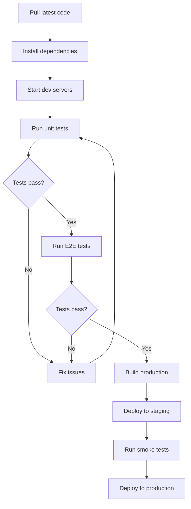

# Pre-Deployment Testing Guide

This guide provides step-by-step instructions for running all tests before deploying InsightHub to production.

## Prerequisites

⚠️ **CRITICAL**: Backend server MUST be running on port 3001 before running tests!

1. **Development environment running:**
   ```bash
   # Start the backend server (port 3001) - REQUIRED FOR TESTS
   cd server && npm run dev
   
   # Start the frontend dev server (port 3000) - in a new terminal
   cd client && npm run dev
   ```

2. **Verify servers are running:**
   ```bash
   # Check backend (should return health status)
   curl http://localhost:3001/health
   
   # Check frontend (should return HTML)
   curl http://localhost:3000
   ```

3. **All dependencies installed:**
   ```bash
   # Install all workspace dependencies
   npm install
   
   # Install test dependencies
   cd tests && npm install
   ```

## Quick Test (Recommended Before Deployment)

Run all unit and integration tests:

```bash
# From project root
./scripts/test-all.sh
```

Expected output:
- ✅ Server tests: Passing
- ✅ Client tests: Passing  
- ✅ Integration tests: 108 passing

## Complete Test Suite

### 1. Unit & Integration Tests

```bash
cd tests
npm test
```

**Expected Results:**
- Test Suites: 9 total (all passing)
- Tests: 108 total (all passing)
- Time: ~4-5 seconds

**What it tests:**
- Authentication & authorization flows
- API endpoints
- Database operations
- Service layer logic
- Middleware functionality

### 2. E2E Tests (End-to-End)

Run all E2E tests across 5 browsers:

```bash
cd tests
npm run test:e2e
```

**Expected Results:**
- 30 tests passing (6 test files × 5 browsers)
- Browsers: chromium, firefox, webkit, Mobile Chrome, Mobile Safari
- Time: ~2-3 minutes

**What it tests:**
- Home page rendering
- Surgical guide report page
- PowerBI report page
- Basic navigation
- Page load performance

### 3. Individual E2E Tests (Optional)

Test specific pages:

```bash
cd tests

# Test home page
npx playwright test e2e/home.spec.js --reporter=line

# Test surgical guide report
npx playwright test e2e/surgical-guide-report.spec.js --reporter=line

# Test PowerBI report
npx playwright test e2e/powerbi-report.spec.js --reporter=line

# Test basic navigation
npx playwright test e2e/basic-navigation.spec.js --reporter=line
```

### 4. Test Coverage (Optional)

Generate test coverage report:

```bash
cd tests
npm run test:coverage
```

Coverage report will be generated in `tests/coverage/lcov-report/index.html`

## Pre-Deployment Checklist

Run through this checklist before deploying:

- [ ] **All servers running**: Backend (3001) and Frontend (3000)
- [ ] **Unit tests passing**: `cd tests && npm test`
- [ ] **E2E tests passing**: `cd tests && npm run test:e2e`
- [ ] **No console errors**: Check browser console on key pages
- [ ] **Environment variables set**: Review `.env` files for production values
- [ ] **Database migrations applied**: Check `migrations/` folder
- [ ] **Build succeeds**: `cd client && npm run build`
- [ ] **Dependencies updated**: Check for security vulnerabilities with `npm audit`

## Common Issues

### Issue: AggregateError or Connection Refused

**Symptoms**: All integration tests fail with "AggregateError"

**Cause**: Backend server is not running on port 3001

**Solution**: Start the backend server:

```bash
# Terminal 1: Start backend
cd server && npm run dev

# Verify it's running
curl http://localhost:3001/health
# Should return: {"status":"ok",...}

# Terminal 2: Run tests
cd tests && npm test
```

### Issue: Rate Limiting (429 errors)

**Solution**: Tests automatically run with `NODE_ENV=test` which increases rate limits.

```bash
# Already configured in tests/package.json
"test": "NODE_ENV=test node --experimental-vm-modules node_modules/jest/bin/jest.js"
```

### Issue: E2E Tests Timeout

**Symptoms**: Tests timeout after 30 seconds

**Solution**: Tests use `domcontentloaded` wait strategy. Ensure dev server is running:

```bash
curl http://localhost:3000  # Should return HTML
```

### Issue: Port Already in Use

**Solution**: Kill existing processes:

```bash
# Find and kill process on port 3000
lsof -ti:3000 | xargs kill -9

# Find and kill process on port 3001
lsof -ti:3001 | xargs kill -9
```

## CI/CD Integration

### GitHub Actions Example

```yaml
name: Test Suite

on: [push, pull_request]

jobs:
  test:
    runs-on: ubuntu-latest
    
    steps:
      - uses: actions/checkout@v3
      
      - name: Setup Node.js
        uses: actions/setup-node@v3
        with:
          node-version: '18'
      
      - name: Install dependencies
        run: |
          npm install
          cd tests && npm install
      
      - name: Run unit & integration tests
        run: cd tests && npm test
      
      - name: Install Playwright browsers
        run: cd tests && npx playwright install --with-deps
      
      - name: Start dev servers
        run: |
          cd server && npm run dev &
          cd client && npm run dev &
          sleep 10
      
      - name: Run E2E tests
        run: cd tests && npm run test:e2e
```

## Test Results Tracking

After running tests, check:

1. **Test output**: All tests should show ✅ passing
2. **Screenshots**: E2E failures generate screenshots in `tests/test-results/`
3. **Logs**: Server logs in `logs/` directory
4. **Coverage**: Coverage report in `tests/coverage/`

## Deployment Flow



## Additional Resources

- [Test All Script](../scripts/test-all.sh) - Automated test runner
- [Playwright Config](../tests/playwright.config.js) - E2E test configuration
- [Jest Config](../tests/jest.config.js) - Unit test configuration
- [Deployment Checklist](./DEPLOYMENT_CHECKLIST.md) - Full deployment guide

## Support

For issues or questions about testing:
- Check test output for specific error messages
- Review `tests/test-results/` for E2E failure screenshots
- Check server logs in `logs/` directory
- Ensure all environment variables are correctly set

---

**Last Updated**: December 25, 2025  
**Test Suite Version**: 1.0.0  
**Total Tests**: 138 (108 unit/integration + 30 E2E)
